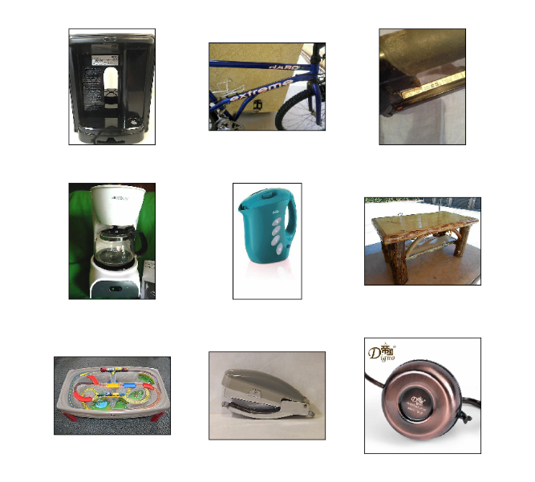
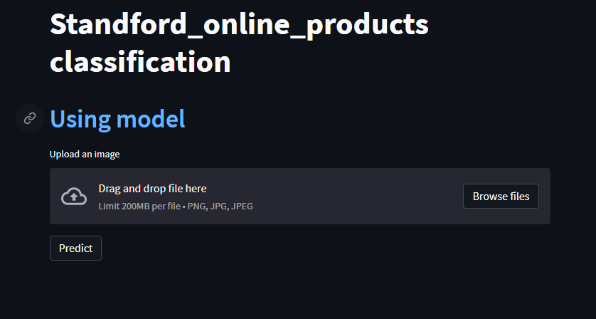
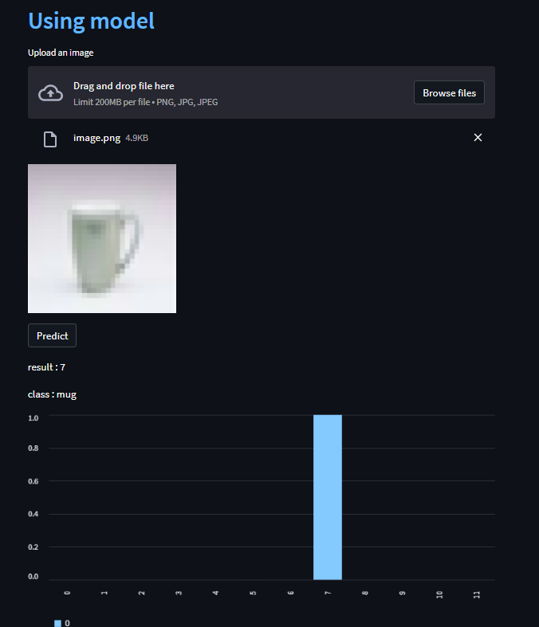

# stanford_online_products
[Stanford Online Products Dataset](https://www.tensorflow.org/datasets/catalog/stanford_online_products)

Dataset size: 2.89 GiB

FeaturesDict({
               'class_id': ClassLabel(shape=(), dtype=int64, num_classes=22634),   
              'image': Image(shape=(None, None, 3), dtype=uint8),    
               'super_class_id': ClassLabel(shape=(), dtype=int64, num_classes=12),
              'super_class_id/num': ClassLabel(shape=(), dtype=int64, num_classes=12),})

## Clone recursively
``` shell
git clone https://github.com/airiuz/stanford_online_products.git
```
## Enter this file
``` shell
cd stanford_online_products
```
## Install Virtual environment
To use the this dataset, it is recommended to create a virtual environment in Python. You can do this by using the virtualenv package. First, install virtualenv using pip:
``` shell
python -m pip install --user virtualenv
```
## give a name this environment
``` shell
python -m venv your_env
```
## Activate this environment
``` shell
your_env\Scripts\activate.bat
```
## Install requirements
``` shell
pip install -r requirement.txt
```
## Open jupyter notebook
``` shell
jupyter notebook
```
## Run streamlit
``` shell
streamlit run streamlit.py
```


## Predict

